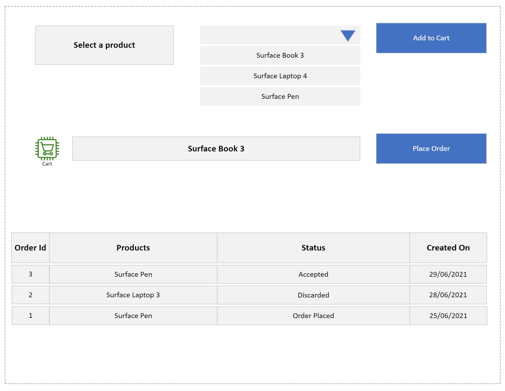

# Specifications

## **Customer facing Website**

---

### **Wireframe**



### **Scenarios**

```gherkin
GIVEN a web page is loaded with list of products with Title
WHEN the user selects a product from the list
AND the user clicks on "Add to Cart" for the selected product
THEN the items should be stored in the user's cart
```

```gherkin
GIVEN an item is added to the cart
AND item has no stock available
WHEN the use clicks on "Place Order"
THEN the order should not be created
AND the user should be given an "Item out of stock" message
```

```gherkin
GIVEN an item is added to the cart
AND the item is in stock
WHEN the use clicks on "Place Order"
THEN the order should be created
AND the user should be given a "Order created successfully." message
```