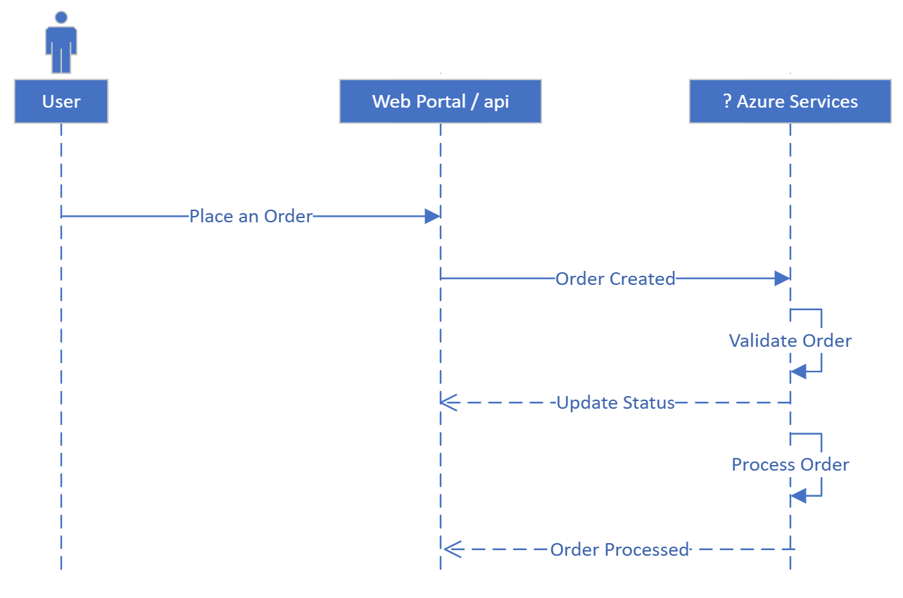

# Specifications

## **System Flow**



## **Customer facing Website**

---

### **Wireframe**


### **Frontend Scenarios**

```gherkin
GIVEN a web page is loaded with list of products with Title
WHEN the user selects a product from the list
AND the user clicks on "Add to Cart" for the selected product
THEN the product should be stored in the user's cart
```

```gherkin
GIVEN a web page is loaded with list of products with Title
AND one of the products have no stock
WHEN the user selects the out of stock product from the list
THEN the user should be given an "Selected product is out of stock" message
AND "Add to Cart" button is disabled for the given product
```

```gherkin
GIVEN an item is added to the cart
AND the item is in stock
WHEN the use clicks on "Place Order"
THEN the order should be created
AND the user should be given a "Order created successfully." message
```

## **Order Processing System**

### **Backend Scenarios**

```gherkin
GIVEN an order is created
AND the item is in stock
WHEN the order is picked by backend service with "Created" status
THEN the order status should be changed to "Accepted"
```

```gherkin
GIVEN an order has been created
AND the item is out of stock
WHEN the order is picked by backend service with "Created" status
THEN the order should be discarded for stock unavailability
AND the order status should be changed to "Discarded"
```

```gherkin
GIVEN an order has been accepted
WHEN the order is picked by backend service with "Accepted" status
THEN a dispatch confirmation email to the customer should be sent
AND the order status should be changed to "Completed"
```
